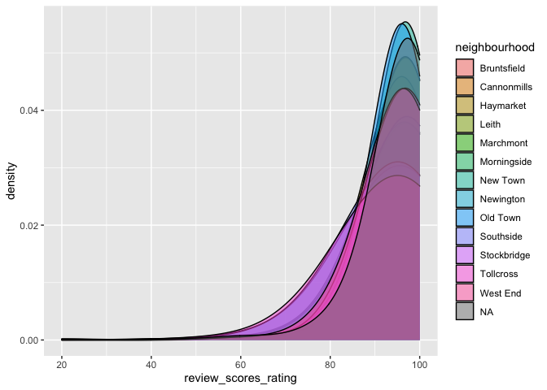

HW 01 - Airbnb listings in Edinburgh
================
Jieming Xiao
07/12/2022

## Load packages and data

``` r
library(tidyverse)
library(dsbox)
library(ggplot2)
library(ggridges)
library(magrittr)
library(dplyr)
```

## Exercises

### Exercise 1

There are 13,245 rows in the dataset.

### Exercise 2

Each row represents a listing of properties.

### Exercise 3

``` r
ggplot(data = edibnb, mapping = aes(x = price)) +
  geom_histogram(binwidth = 500) +
  facet_wrap(~neighbourhood)
```

    ## Warning: Removed 199 rows containing non-finite values (stat_bin).

<!-- -->

### Exercise 4

Remove this text, and add your answer for Exercise 4 here.

``` r
  edibnb %>%
  na.omit(edibnb) %>%
  group_by(neighbourhood) %>%
  summarise(median_price = median(price)) %>%
  top_n(n = 5, median_price)
```

    ## # A tibble: 5 × 2
    ##   neighbourhood median_price
    ##   <chr>                <dbl>
    ## 1 New Town                99
    ## 2 Old Town                90
    ## 3 Southside               79
    ## 4 Stockbridge             80
    ## 5 West End                81

``` r
edibnb %>%
  na.omit(edibnb) %>%
  group_by(neighbourhood) %>%
  summarise(min_price = min(price),
    mean_price = mean(price),
    median_price = median(price),
    max_price = max(price),
    sd_price = sd(price),
    IQR_price = IQR(price)
  )
```

    ## # A tibble: 13 × 7
    ##    neighbourhood min_price mean_price median_price max_price sd_price IQR_price
    ##    <chr>             <dbl>      <dbl>        <dbl>     <dbl>    <dbl>     <dbl>
    ##  1 Bruntsfield          20       93.7         77         660     75.5      69  
    ##  2 Cannonmills          20       98.5         75         500     68.7      54  
    ##  3 Haymarket            14       80.9         65         750     64.4      50  
    ##  4 Leith                 0       81.6         65         899     63.9      50  
    ##  5 Marchmont            16       99.3         75         500     80.3      70  
    ##  6 Morningside          18       81.3         67.5       450     56.5      60  
    ##  7 New Town             23      128.          99         800     92.8      80  
    ##  8 Newington            10       90.6         70         900     81.1      55  
    ##  9 Old Town             15      122.          90         999    104.       66.5
    ## 10 Southside            10      101.          79         800     88.3      65  
    ## 11 Stockbridge          23      100.          80         750     77.0      65  
    ## 12 Tollcross            10       89.8         75         500     61.7      45  
    ## 13 West End             19      108.          81         999     88.2      65

### Exercise 5

Remove this text, and add your answer for Exercise 5 here.

``` r
ggplot(edibnb, aes(x = review_scores_rating,
                  fill = neighbourhood)) +
  geom_density(adjust = 7, 
               alpha = 0.5) 
```

    ## Warning: Removed 2177 rows containing non-finite values (stat_density).

<!-- --> The
majority of the rating scores are beyond 80, and very few rating scores
are below 60, which means guests rate properties generously in general.
For neighborhoods, properties in New Town and Newington are getting the
most high rating scores, while properties in the Southside and West End
get less higher ratings.
